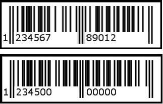
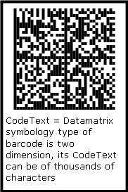

## **Specify Symbologies for Barcodes**
### **What is Barcode**
Barcode is a system for automatic identification of items, such as books in a library, by means of printed bars of different widths which represent numbers. Barcodes are used for many reasons among them are, to speed up check out, to track sales and to help with inventory. The first set of numbers in a barcode is the manufacturer code, the second set of numbers in the barcode is the product code. The barcode was introduced in the early 80s and is often printed on the record sleeve only, sometimes also on the center record paper label.
### **What is Barcode Symbology**
Barcode Symbology is the protocol that defines a standard for arranging the bars and spaces (between the bars) that comprise a particular type of barcode, such as UPCA, EAN, Code128 etc.
### **Aspose.BarCode and Barcode Symbologies**
Aspose.BarCode supports nearly all popular barcode symbologies. All barcode generating classes like LinearBarCode , [BarCodeControl](https://apireference.aspose.com/net/barcode/aspose.barcode.windows.forms/barcodecontrol) and [BarCodeWebControl](https://apireference.aspose.com/net/barcode/aspose.barcode.web.ui/barcodewebcontrol) have a common property named as [SymbologyType](https://apireference.aspose.com/net/barcode/aspose.barcode/barcodebuilder/properties/symbologytype) that is used to set the symbology of a barcode. Developers can assign any symbology to SymbologyType property from the pre-defined symbologies supported by BarcodeGenerator. A list of all pre-defined symbologies is listed below.

|**Symbologies**|**Description**|
| :- | :- |
|Codabar|Specifies that the data should be encoded with Codabar barcode specification|
|Code11|Specifies that the data should be encoded with Code11 barcode specification|
|Code128|Specifies that the data should be encoded with Code128 barcode specification|
|Code39Standard|Specifies that the data should be encoded with Standard Code39 barcode specification|
|Code39Extended|Specifies that the data should be encoded with Extended Code39 barcode specification|
|Code93Standard|Specifies that the data should be encoded with Standard Code93 barcode specification|
|Code93Extended|Specifies that the data should be encoded with Extended Code93 barcode specification|
|EAN13|Specifies that the data should be encoded with EAN-13 barcode specification|
|EAN8|Specifies that the data should be encoded with EAN-8 barcode specification|
|BooklandEAN|Specifies that the data should be encoded with BooklandEAN barcode specification|
|Interleaved2of5|Specifies that the data should be encoded with Interleaved 2 of 5 barcode specification|
|MSI|Specifies that the data should be encoded with MSI Plessey barcode specification|
|Standard2of5|Specifies that the data should be encoded with Standard 2 of 5 barcode specification|
|UPCA|Specifies that the data should be encoded with UPC-A barcode specification|
|UPCE|Specifies that the data should be encoded with UPC-E barcode specification|
|Postnet|Specifies that the data should be encoded with Postnet barcode specification|
|Planet|Specifies that the data should be encoded with Planet barcode specification|
|Pdf417|Specifies that the data should be encoded with Pdf417 barcode specification|
|Datamatrix|Specifies that the data should be encoded with Datamatrix barcode specification|
|QR|Specifies that the data should be encoded with QR barcode specification|
|Aztec|Specifies that the data should be encoded with Aztec barcode specification|
#### **C#**


### **Set Code text**
A barcode is the representation of characters in the form of bars and spaces between them. So, it is a simple fact that we would also have to assign some characters to Aspose.BarCode so that the input characters could be converted to a barcode. We know that Aspose.BarCode has three different classes ([BarcodeGenerator](https://apireference.aspose.com/net/barcode/aspose.barcode.generation/barcodegenerator), [BarCodeControl](https://apireference.aspose.com/net/barcode/aspose.barcode.windows.forms/barcodecontrol) and [BarCodeWebControl](https://apireference.aspose.com/net/barcode/aspose.barcode.web.ui/barcodewebcontrol)) to create barcodes for different kinds of applications. All these classes have a common property, CodeText. All characters to be encoded to barcode are assigned to CodeText property of any barcode class.
### **Code text versus Symbology**
Developers can assign any set of characters to CodeText property but only according to its symbology type. For example, If the EncodeType property of a barcode control is Symbology.EAN13, the valid character set of EAN13 specification is limited to numeric values and contains 13 digits only. If you attempt to shorter [CodeText](https://apireference.aspose.com/net/barcode/aspose.barcode/barcodebuilder/properties/codetext) to it, zero will be added, if longer CodeText, the outbound part will be truncated.
#### **C#**


|**When CodeText is too long or too short**|
| :- |
||
Some symbologies of barcode accept longer CodeText. If CodeText is longer than the image width, it will be wrapped to the next line.

|**CodeText wrapping**|
| :- |
||
Human readable CodeText is for human reading only, it will not affect the machine scanning process. Some 2D barcodes can contain a huge chunk of data, up to thousands of characters, you might choose not to show the code text. Visit [here](/barcode/net/working-with-barcode-text-appearance/) for how to control the appearance of CodeText. For the functionality differences in Aspose.BarCode .Net and Aspose.BarCode Java, please check out [EditionType](/pages/createpage.action?spaceKey=barcodenet&title=Edition+Types&linkCreation=true&fromPageId=12943833)
