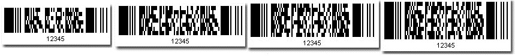

## **Create a PDF417 Barcode**
Data File 417, is a two-dimensional stacked barcode symbology capable of encoding over a kilobyte of data per label. It was developed by Symbol Technologies (1989-1992) and is currently maintained by ANSI/AIM USA. To create a Pdf417 barcode please follow the steps given below.

1. Instantiate a [BarcodeGenerator](https://apireference.aspose.com/net/barcode/aspose.barcode.generation/barcodegenerator)
1. Set up its EncodeTypes property to be Pdf417
1. Set CodeText property for the data you want to encode


### **Pdf417 Error correction level**
Pdf417 barcode with error correction can withstand certain kind of damage. [BarcodeGenerator](https://apireference.aspose.com/net/barcode/aspose.barcode.generation/barcodegenerator) with a higher error correction level will produce a bigger image, here is a sample with maximum error correction levels:


### **Truncated Pdf417**
[Aspose.BarCode](https://apireference.aspose.com/net/barcode) supports the truncated Pdf417 version which omits the right-hand side quiet zone in order to save space. Setting [Pdf417Truncate](https://apireference.aspose.com/net/barcode/aspose.barcode.windows.forms/barcodecontrol/properties/pdf417truncate) property to true will lead to a comparatively smaller image.
### **Rows and columns**
Rows and columns settings are aiming at general two-dimensional barcodes, applicable to Pdf417. A Pdf417 barcode consists of black and white rectangular modules. If Rows and Columns settings are illegal, the encoder will simply ignore those settings. Setting Rows and Columns to be zero means no Rows and Columns settings. The following sample pictures are Pdf417 barcodes with the same CodeText but of different Rows and Columns settings:

|**Different Rows and Columns settings**|
| :- |
||
### **Pdf417 Compaction Mode**
Setting [Pdf417CompactionMode](https://apireference.aspose.com/net/barcode/aspose.barcode.windows.forms/barcodecontrol/properties/pdf417compactionmode) property will set the corresponding compaction mode. Below are the 4 modes that can be set using Aspose.BarCode for .NET: Auto: Automatically detect compaction mode

- Text: Text compaction, suitable for text data
- Numeric: Numeric compaction mode, suitable for numeric data
- Binary: Binary compaction mode, suitable for binary data
  Below code snippet generates a Pdf417 barcode using the Text compaction mode:



Please note that the barcode size is bigger because we applied Binary compaction mode to encode text data. You may set the Compaction mode to Auto for choosing the best possible compaction mode or choose carefully based on the type of CodeText value.
## **Generate Multiple MacroPdf417 Barcodes for Large or Multiple Codetext Values**
Multiple MacroPdf417 barcodes can be generated if we either have multiple CodeText values or a very large CodeText value. In case of large CodeText value, we may break the large value into multiple smaller CodeText values and generate multiple MacroPdf417 barcodes for these. Each generated barcode maintains the File ID and Segment ID so that these could be recognized incorrect series. The last segment flag is also set in the last barcode. The following code snippet shows you how to generate four MacroPdf417 barcodes for 4 different CodeText values.


