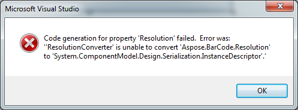

## **Error Message when Running App with BarCodeControl**
Following are the known issues of Visual Studio 2010 with .NET framework 4.0 and .NET framework 4.0 client profile.
### **Code Generation for Property 'Resolution' Failed**
When adding a bar code control to a form and press **F5** (**Run**) in Visual Studio, and error message about the Resolution property appears:

The problem appears only once, after a bar code control has been added to the form. It appears when you run the code, or close Visual Studio. Build the code again: the error message will not appear again. It works perfectly using Visual Studio 2012.
## **.NET Compact Framework**
It is observed that on some specific windows versions such as Windows Mobile 5.0-6.0 the compact framework assemblies signed with certificate (or dual signed certificates) does not work as expected and are not able to load correctly (a TypeLoadException is thrown). To overcome the issue a user needs to remove any certificate and then use the updated assembly. Please note that you make this on your own risk and we do not guarantee valid work due to such assembly change. Nor we ship assemblies without signature since this is a potential security threat. Instead customers should avoid such old OS usages if possible and use some never editions or service packs which resolve certificate signing issues.
