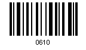
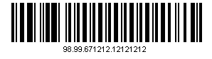
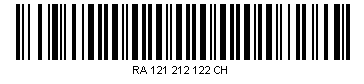

{} 

The SwissPost Parcel symbology is used by Swiss Post, the post office in Switzerland. It detects each parcel and serves as a means of verifying mailing and delivery and checking the service offering. 
All parcels must have a unique barcode which is used to identify the item in automatic processing. The symbology is based on Code128 (charsets B and C).

SwissPost has three types:

- [Additional Service](/barcode/net/barcodes-using-swisspost-parcel-symbology-html/)
- [Domestic Mail](/barcode/net/barcodes-using-swisspost-parcel-symbology-html/)
- [International Mail](/barcode/net/barcodes-using-swisspost-parcel-symbology-html/)

{} 
### **SwissPost Parcel Symbology**
Generation and recognition modules auto detect which type used, so user don’t need to set this type and there is no property for that.

1. Additional Service: Four digits with defined allowed values: 0327, 0322, 0340, 0341, 0610, 1007 and 2512.
1. Domestic Mail: 18 digits long. It must start with 98.
1. International Mail: Format: RXxxxxxxxxxCH. X - upper case letter, x - digit, the last x is a checksum. The checksum is internal, always exists and does not depend on our checksum properties, but is validated during recognition.

Important points:

- If no conditions met Domestic Mail used with generation.
- If no conditions met Code128 symbology used with recognition

Since the barcode is based on Code128, Code128's checksum is added and validated.
#### **Programming Samples**
Below are code snippets that create SwissPost Parcel barcodes.
#### **Create a SwissPost Parcel Barcode with the Additional Service Type**
**C#**



     // Generate the barcode

    BarCodeBuilder builder = new BarCodeBuilder();

    // Set symbology type

    builder.SymbologyType = Symbology.SwissPostParcel;

    // Set the code text    

    string codetext = "0610";

    builder.CodeText = codetext;

    // Save barcode on local

    builder.Save("c:\\barcode.png");



**Sample Additional Service Type** 

#### **Create a SwissPost Parcel Barcode with the Domestic Mail Type**
**C#**



     // Generate the barcode

    BarCodeBuilder builder = new BarCodeBuilder();

    // Set symbology type

    builder.SymbologyType = Symbology.SwissPostParcel;

    // Set the code text

    string codetext = "989967121212121212";

    builder.CodeText = codetext;

    // Save barcode on local

    builder.Save("c:\\barcode.png"); 



**Sample Domestic Mail Type** 

#### **Create a SwissPost Parcel Barcode with the International Mail Type**
**C#**



     // Generate the barcode

    BarCodeBuilder builder = new BarCodeBuilder();

    // Set symbology type

    builder.SymbologyType = Symbology.SwissPostParcel;

    // Set the code text

    string codetext = "RA121212122CH";

    builder.CodeText = codetext;

    // Save barcode on local

    builder.Save("c:\\barcode.png");



**A sample International Mail Type** 

Related articles:

- [Working with barcode recognition](/barcode/net/read-barcodes-html/)
- [Basic barcode image features](/barcode/net/image-formatting-and-display-settings-html/)
- [Barcode orientation](/pages/createpage.action?spaceKey=barcodenet&title=Barcode+Orientation&linkCreation=true&fromPageId=12943378)
