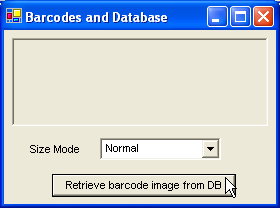
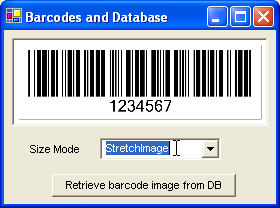

## **How to Save Retrieve Barcodes to and from Database in .NET**
We know that it is possible to save a barcode as an image file using [Aspose.BarCode](http://www.aspose.com/categories/.net-components/aspose.barcode-for-.net/default.aspx). Developers can use this feature to obtain a barcode image and then save it to some location on a network or a local machine. But sometimes, we need more flexibility. If you are working in some company and generate barcodes regularly then it can be a great trouble for you to manage all these barcode images to some folder of your local or network based storage device. In such circumstances, it would be better to store your barcodes in some database.

This article will discuss Two Approaches for developers to manage barcodes in databases as follows:

- Storing Barcode Information in Database
- Storing Barcode Image in Database

Every approach has its own merits and demerits. So, it's upto the developers to decide that which approach fulfills their requirements.
### **1st Approach: Storing Barcode Information**
The most simple approach to manage barcodes is to store barcode information in database. This approach allows developers to store barcode information like its Code text and Symbology to the database. So, instead of barcode image, only barcode details are stored in database. When a barcode is needed to display then those barcode details are retrieved from database to generate a barcode image at runtime.To understand this approach, let's create a small application that generates a barcode and the barcode's details such as its Code text and Symbology are stored in a SQL Server database.
#### **Creating a Database**
First of all, we should create a database using any DBMS like Oracle, SQL Server or Ms Access etc. For this article, we have chosen SQL Server 2000 for creating the database.
We have created a table named barcodes in the database with three columns in it. First column, bid is acting as a Numeric Primary Key and Table Identity Column as well. It means that bid column will automatically generate it's primary key (unique) values and we don't have to enter any unique values in it by ourselves. Other two columns, codetext and symbology are of varchar type, which means that these columns can store variable length of characters.
#### **Saving Barcode Details to Database**
Now, we have to create an application that generates a specific barcode image according to user inputs. We have used BarCodeControl in our windows application to generate barcode image. BarCodeControl has CodeText and SymbologyType properties through which we can access Code text and Symbology of the barcode generated by BarCodeControl. So, all we have to do, is to Open a database connection using SqlConnection and insert the Code text and Symbology of the barcode into the barcodes table by calling ExecuteNonQuery method of SqlCommand. To enhance the efficiency of this insertion, you may use a Parameterized SQL Query, where @Codetext and @Symbology are parameters as shown below:
#### **C#**

#### **Retrieving Barcode Details from Database**
If it is required to display the barcode image whose information was stored in the database, the details of that specific barcode are retrieved from database and a barcode is generated at runtime according to those barcode details. A Form is created that contains a Panel (to hold the barcode control generated at runtime) and a Button to initiate the process.

When the button is clicked, a method RetrieveFromDB is invoked that connects to the database, selects specific barcode details and fills the DataTable with those barcode details using SqlDataAdapter. A BarCodeControl is created at runtime. It's CodeText and SymbologyType properties are configured using barcode details in DataTable. Once the BarCodeControl is configured then it is added to Controls collection of the Panel in our windows form as shown below:
#### **C#**


After the BarCodeControl is added to Controls collection of Panel, barcode image gets visible.
### **Merits**
- This approach works great for small and simple applications where only simple barcodes are generated
- It's rather easy to store a barcode in the form of a few text values in the database than storing the barcode image
- Using this approach, developers can save their resources like database
- Applications work more faster
### **Demerits**
If you are creating more complex barcode images by also customizing there:* Fore Color

- Background Color
- Bar Height
- Wide to Narrow Ratio
- X-Dimension
  and other properties then you would have to create extra columns in your database table to store the information about all properties related to a barcode. Then this approach would depict the following problems:
- More columns in table would be created that will consume more storage resources
- Whenever some new information about the barcode would be needed to be stored, changes will be made to not only database but also to the source code
- Increasing the number of columns in the database table would also take more efforts by you to write more lines of code
  Just assume some extra properties of the barcode that would be required to be stored in the database.
## **2nd Approach: Storing Barcode Image**
To save yourself from writing more lines of source code and creating a large number of columns in a database table, there is another approach and it is to store the barcode image itself to the database. A barcode can be simple with just two properties or complex with more number of properties.
### **Modifying the Database to Store Image**
Using this approach, you can store any barcode image in database ranging from simplest to most complex one. For saving an image to database, we will have to make some changes to our database. A new table (barcodeImages) will be created. A column barcodeImage with image data type will be created to store the image
### **Saving Barcode Image to Database**
When the Save to DB button is clicked then StoreImageInDB method is called that stores barcode image in the database so that it can be used later. To store a barcode image in the database, it is necessary to convert an image into the form of a MemoryStream by calling the Save method of BarCodeControl.BarCodeImage property. After that we can retrieve the image data in binary from by calling GetBuffer method of the MemoryStream, ms and then store image in the database by calling the ExecuteNonQuery method of a Parameterized SQL Query as shown below:

**[C#]**



 void StoreImageInDB()

{

    SqlConnection con = null;

    string sql = "INSERT INTO barcodeImages(codetext,barcodeImage) VALUES(<at:var at:name="Codetext," />BarcodeImage)";

    MemoryStream ms = new MemoryStream();

    this.barCodeControl1.BarCodeImage.Save(ms, ImageFormat.Bmp);

    try

    {

        con = new SqlConnection(connectionString);

        con.Open();

        SqlCommand sqlInsert = new SqlCommand();

        sqlInsert.Connection = con;

        sqlInsert.CommandText = sql;

        sqlInsert.Parameters.Add("@Codetext", this.barCodeControl1.CodeText);

        SqlParameter param = new SqlParameter("@BarcodeImage", SqlDbType.Image, ms.GetBuffer().Length);

        param.Value = ms.GetBuffer();

        sqlInsert.Parameters.Add(param);

        sqlInsert.ExecuteNonQuery();

    }

    catch (Exception ex)

    {

        MessageBox.Show(ex.ToString());

    }

    finally

    {

        if (con != null)

            con.Close();

    }

}



### **Retrieving Barcode Image from Database**
After the barcode image is stored in database then we can test the stored barcode image by getting it back from database and showing it on the form. We have added a PictureBox to our windows form so that barcode image can be shown in it. To change the SizeMode of the PictureBox, a ComboBox with some size modes, is also used as shown in the figure below:

**Figure: Clicking button to retrieve barcode image from database
**

When the button is clicked to retrieve barcode image from the database, barcode image is fetched from database and converted back into MemoryStream and then an image is obtained using that MemoryStream by calling the FromStream method of Image class. The obtained image is then passed to the Image property of the PictureBox as shown below:

**[C#]**



 void RetrieveImageFromDB()

{

    SqlConnection con = null;

    try

    {

        con = new SqlConnection(connectionString);

        string sqlStatement = "SELECT * FROM barcodeImages";

        SqlDataAdapter adapter = new SqlDataAdapter(sqlStatement, con);

        DataTable dt = new DataTable("barcodeImages");

        adapter.Fill(dt);

        MemoryStream ms = new MemoryStream((byte[])dt.Rows[0]["barcodeImage"]);

        Image image = Image.FromStream(ms, true);

        pictureBox1.Image = image;

    }

    catch (Exception ex)

    {

        MessageBox.Show(ex.ToString());

    }

    finally

    {

        if (con != null)

            con.Close();

    }

}



Once the image is assigned to the Image property of the PictureBox, the barcode image gets visible on the screen as shown below in the figure:

**Figure: Barcode image retrieved from database being shown in a PictureBox under stretch mode
**

##### **Conclusion**
Both approaches discussed so far, have their own advantages and disadvantages which are briefly described in the article. Generally, for simple applications where the simple and identical barcodes are generated, 1st approach can work better where as for such applications that allow users to create complex and different kinds of barcodes, 2nd approach can do its best. But still, developers can make an efficient use of any approach in any kind of application according to their requirements.
