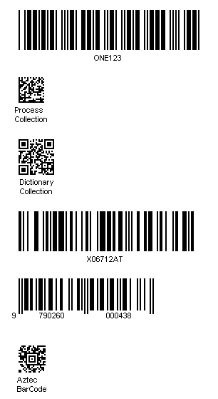

{} 

Aspose.BarCode for .NET can efficiently create multiple optimized barcodes on a single image. It also supports generating multiple types of barcodes such as postal, QR, PDF417, EAN, Code 39, Code128, ISBN, MSI, GS1, etc.

{} 
#### **Programming Sample**


**A sample image having multiple barcodes** 

