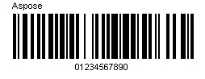
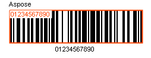

## **BarCode Recognition Basics**
Aspose.BarCode for .NET component contains two powerful classes, [BarcodeGenerator](https://apireference.aspose.com/net/barcode/aspose.barcode.generation/barcodegenerator) and [BarCodeReader](https://apireference.aspose.com/net/barcode/aspose.barcode.barcoderecognition/barcodereader), handling BarCode images generation and recognition respectively. BarCodeReader reads most commonly used 1D and 2D barcodes, detecting them anywhere.
### **How to scan a barcode from a picture**
The following example demonstrates how to scan a picture of a barcode image using Aspose.BarCode
#### **C#**


|**A barcode image**|**Scan results**|
| :- | :- |
|||
## **Read Barcode from Stream**
#### **C#**

## **Recognizing Barcode Symbology**
This section shows the basic settings of BarCodeReader. We will specify the Symbology type in the constructor of BarCodeReader class and use the [BarCodeReader.ReadBarCodes()](https://apireference.aspose.com/net/barcode/aspose.barcode.barcoderecognition/barcodereader/methods/readbarcodes) method to recognize the barcodes from the image. This should be the case if we already know the Symbology Type.
### **SymbologyType of a barcode**
If we specify the Symbology Type in the constructor, the program will know beforehand about the symbology type to be recognized and it will be faster than not passing symbology type in the constructor. If we know the types of barcode ahead, recognition will speed up a lot. The following code snippet shows you how to specify the symbology Type.
#### **C#**


For unknown types of barcodes, either set call Read() method with no arguments or programmatically loop through every Symbology.
### **BarCodeReadType**
[GetReadType()](https://apireference.aspose.com/net/barcode/aspose.barcode.barcoderecognition/barcodereader/methods/getreadtype) method of [BarCodeReader](https://apireference.aspose.com/net/barcode/aspose.barcode.barcoderecognition/barcodereader) class returns the symbology type of the recognized barcode. Continuing the sample above, the first recognized barcode's SymbologyType is: For those variation barcode Symbologies, its original SymbologyType or superset SymbologyType will be returned. For example, both Code39Standard and Code39Extended barcode will be recognized as Code39Extended barcode.
### **CodeText**
GetCodeText() method of a BarCodeReader class returns the string which is the decoded data from the barcode.
### **Recognizing Multiple Symbologies in Single Image**
There might be such situations in which there are multiple barcodes in a single image. Aspose.BarCode can easily recognize all the barcodes of the supported symbology types. This can be done by specifying multiple symbology types separated by bitwise OR operator “|” in the barcode constructorSee the image below. It contains 2 barcodes of type Code39Standard and Pdf417. Since [BarCodeReader.ReadBarCodes()](https://apireference.aspose.com/net/barcode/aspose.barcode.barcoderecognition/barcodereader/methods/readbarcodes) method returns a Boolean value, you can call it in a while loop to recognize all the barcodes in the image. The Read() method will return true for the first barcode, again return true for the second barcode and then it will return false in the third iteration.
#### **C#**


In the above code snippet, we assumed that we already knew the symbology types of the barcodes in the image. So, we specified the symbologies separated by **bitwise OR “|”** operator. If the symbologies are not known in advance, you can simply use [BarCodeReadType.AllSupportedTypes](https://apireference.aspose.com/net/barcode/aspose.barcode.barcoderecognition/barcodereadtype) to check for any symbology type. In this case, the constructor in the above code snippet will be modified as follows:
#### **C#**

## **Get all Possible 1D Barcodes from an Image**
The [BarCodeReader.GetAllPossibleBarCodes](https://apireference.aspose.com/net/barcode/aspose.barcode.barcoderecognition/barcodereader/methods/getallpossiblebarcodes) method is only for 1D barcodes. It returns an array of all possible barcodes found. This array holds all information about the barcodes like code text, symbology, recognition percentage, and region details. The following code snippet shows you how to get all possible 1D barcodes from an image.
#### **C#**

## **Datamatrix Barcode**
### **Detect Decorated Datamatrix Barcode**
[Aspose.BarCode for .NET API](https://www.aspose.com/products/barcode/net) allows developers to detect decorated DataMatrix barcode on the image. To detect the decorated DataMatrix barcode, developers have to configure QualitySettings by using BarCodeReader.QualitySettings property which is an instance of QualitySettings class. QualitySettings allows to configure recognition quality and speed manually. You can quickly set up QualitySettings by embedded presets: HighPerformance, NormalQuality, HighQuality, MaxBarCodes or you can manually configure separate options. The default value of QualitySettings is NormalQuality. The following code snippet shows you how to detect decorated DataMatrix barcode.
#### **C#**


**Result:** DataMatrix: StarDatamatrix
### **Detect Dot Peen Datamatrix Barcode**
[Aspose.BarCode for .NET API](https://www.aspose.com/products/barcode/net) allows developers to detect dot peen DataMatrix barcode on the image. To detect the dot peen DataMatrix barcode, developers have to set the BarCodeReader.[AllowDatamatrixIndustrialBarcodes](https://apireference.aspose.com/net/barcode/aspose.barcode.barcoderecognition/qualitysettings/properties/allowdatamatrixindustrialbarcodes) property to true. The [AllowDatamatrixIndustrialBarcodes](https://apireference.aspose.com/net/barcode/aspose.barcode.barcoderecognition/qualitysettings/properties/allowdatamatrixindustrialbarcodes) property allows engine for Datamatrix to recognize dashed industrial Datamatrix barcodes. Following is the code illustration.
#### **C#**


**Result:** 
DataMatrix: BERMA Macchine Budrio (BO)
DataMatrix: BERMA Macchine Budrio (BO)
DataMatrix: BERMA Macchine Budrio (BO)
DataMatrix: BERMA Macchine Budrio (BO)
DataMatrix: BERMA Macchine Budrio (BO)
DataMatrix: BERMA Macchine Budrio (BO)
## **Macropdf417 Barcode**
### **Reading Multiple Macropdf417 Barcode Images**
In Generating Multiple MacroPdf417 Barcodes for Large or Multiple Code text Values articles, we generated multiple Macropdf417 barcodes for multiple code text values. Now, we will create a program for recognizing the barcodes, which were generated in the above mentioned article. We recognize all the barcode images placed in the folder using the [BarCodeReader](https://apireference.aspose.com/net/barcode/aspose.barcode.barcoderecognition/barcodereader) class. The BarCodeReader class returns the Segment ID, File ID and Last Segment flag (true/false) for each for the MacroPdf417 barcodes.
#### **C#**

### **Reading Multiple MacroPdf417 Barcodes**
Multiple Macro Pdf417 barcodes can be recognized. It is supported. We can recognize the segments of Macro PDF417 one by one. Each recognized bar code includes the File ID, Segment ID, and Segment Count and it is must have the same File ID assigned to it. In the below code sample, we recognize 2 Macro Pdf417 barcodes for 2 different code text values.
#### **C#**

## **Recognizing Barcode in WPF Project**
Aspose.BarCode supports recognizing barcodes in WPF projects. To do so, specify the symbology type in the constructor of the BarCodeReader class and use the [ReadBarCodes()](https://apireference.aspose.com/net/barcode/aspose.barcode.barcoderecognition/barcodereader/methods/readbarcodes) method to recognize the barcodes from the barcode control. Aspose.BarCode.WPF.dll should be referenced in WPF applications for barcode generation and recognition. To use Barcode in WPF Project please the steps given follow.

1. Create a new WPF application in Visual Studio 2012.
1. Add a reference to Aspose.BarCode.WPF.dll by right-clicking the project and selecting **Add Reference**.
1. Locate the DLL in the folder that you installed Aspose.BarCode to.
1. Add the Aspose.BarCode control on the toolbox.
1. Drag the control to the form.
1. Right-click the control and select **Properties**.
1. Adjust barcode properties like code text, symbology type, fonts, colors etc.
1. Please see details: [Using with WPF](/pages/createpage.action?spaceKey=barcodenet&title=Using+with+WPF&linkCreation=true&fromPageId=12943829).

Now write the code that recognizes the barcode:

1. Drag a button control to the form.
1. Add the following code to its Click event.

The code below specifies the symbology read type and image format in the BarCodeReader class constructor.
#### **C#**


For more WPF samples, please view the **Downloads** section at [www.aspose.com](http://www.aspose.com/).
## **Read Most Common Barcodes**
#### **C#**

## **Read Postal Type Barcodes**
#### **C#**

## **Read 1D Barcodes**

