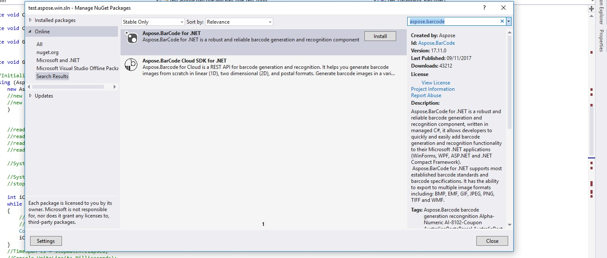
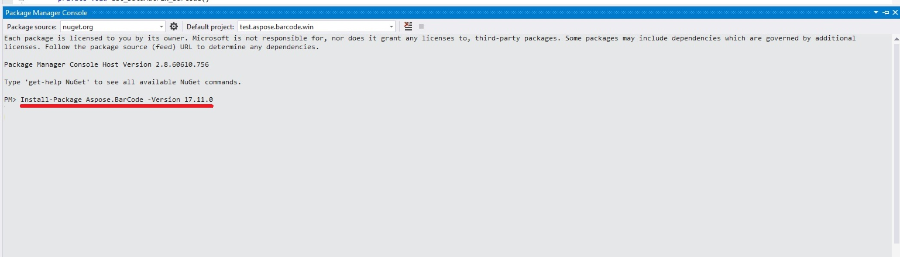
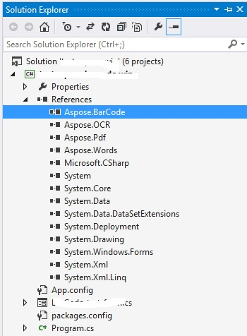

## **Installing Aspose.BarCode for .NET through NuGet**
NuGet is the easiest way to download and install Aspose .NET APIs. **Open** Microsoft Visual Studio. Select **TOOLS** menu, goto **NuGet Package Manager** and select **Manage NuGet packages for solution**. Search 'aspose.barcode' keyword. This will find the desired Aspose API. Click on "Install" button, the selected API will be downloaded and referenced in your project.

## **Install or Update Aspose.BarCode using the Package Manager Console**
You can follow the steps below to install or upgrad the Aspose.BarCode API using the package manager console:
Open your solution/project in Visual Studio.
Select **TOOLS** -> **NuGet Package Manager** -> **Package Manager Console** from the top menu. This will open package manager console.

Type the command “Install-Package Aspose.BarCode -Version x.x.0” and press enter to install latest full release into your application. Alternatively, you can add the "-prerelease" suffix to the command in order to specify that the latest release including hot fixes is to be installed as well.

If you are not familiar with the Aspose EULA <http://www.aspose.com/corporate/purchase/end-user-license-agreement.aspx> then it is a good idea to read the license referenced in the URL. 
You should now find that Aspose.BarCode has successfully been added and referenced in your application for you.

In the package manager console, you can use the command **Update-Package Aspose.BarCode.NET** and press enter to check for any updates to the Aspose.BarCode package and install them if present. You can also add the "-prerelease" suffix to update latest release.
## **Referencing the Component**
By following the steps given below, one can add reference to Visual Studio .NET project:

1. In the Solution Explorer, expand the project node you want to add a reference to.
1. Right-click **References** node for the project and select **Add Reference** menu item.
1. In the Add Reference dialog box, select the **.NET** tab (usually selected by default).
1. If you have used MSI installer to install Aspose.BarCode, you will see Aspose.BarCode in the top pane. Select it and click the **Select** button.
1. If you have downloaded and unpacked the DLL only, click the **Browse** button and lock for Aspose.BarCode.dll. 
   You have referenced Aspose.BarCode and it should appear in the **SelectedComponents** pane of the dialog box.
1. Click **OK**.
1. An Aspose.BarCode reference appears under the **References** node of the project.
## **Uninstalling Aspose.BarCode for .NET**
If you have used MSI installer to deploy Aspose.BarCode, follow these steps to completely remove the component and the associated demos and documentation:

1. From the **Start** menu, select **Settings** and then **Control Panel**.
1. Click **Add/Remove Programs**.
1. Select Aspose.BarCode.
1. Click **Change/Remove** to remove Aspose.BarCode.
## **Targeting Specific .NET Framework Version**
Although Aspose.BarCode references .NET Framework 1.1, it is possible to use it on a machine with only version 1.0 installed. But you need to add an entry to the application configuration file to redirect the references because otherwise, the component will try to load assemblies from .NET Framework 1.1. Each assembly that makes up the .NET Framework must be redirected to use .NET Framework version 1.0. The configuration file is an XML file that can be changed as needed. Developers can use it to change settings without recompiling applications. The name and location of the application configuration file depending on the application's host, which can be one of the following:

- Executable--hosted application: The configuration file for an application hosted by the executable host is in the same directory as the application. The name of the configuration file is the name of the application with a .config extension. For example, an application called myApp.exe can be associated with a configuration file called myApp.exe.config.
- ASP.NET-hosted application: ASP.NET configuration files are called Web.config and placed in the application directory as well.

Enter the following XML in the application configuration file:
#### **XML**


For more information see MSDN article [http://msdn.microsoft.com/library/default.asp?url/library/en-us/cpguide/html/cpcontargetingnetframeworkversion.asp](http://msdn.microsoft.com/library/default.asp?url=/library/en-us/cpguide/html/cpcontargetingnetframeworkversion.asp).
