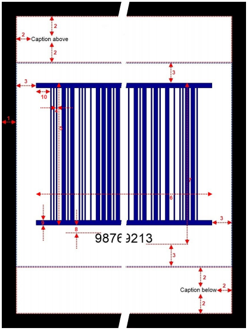

{} 

This page contains release notes information for Aspose.BarCode for .NET 19.3.

{} 
## **All Changes**

|**Key**|**Summary**|**Category**|
| :- | :- | :- |
|BARCODENET-37016|Major refactoring of generated image layout|Enhancement|
|BARCODENET-37145|BarCodeReader.GetAngle() returns radians instead of degree|Bug|
|BARCODENET-37146|Inconsistent angle fetched for barcodes with the same orientation|Bug|
|BARCODENET-37137|Bitmap and PDF not readable by BarCodeReader|Bug|
|BARCODENET-37053|Unable to read QR Barcodes|Bug|
## **Aspose.Barcode.Generation.V3.BarcodeGenerator specification**
` `Please note that this new generation v3 API will become the one and only in a couple of months and there will be no back compatibility for BarcodeBuilder and old BarCodeGenerator APIs. Moreover, the UI components and SSRS component will also be changed accordingly.
### **Generation**
#### **Usage Example:**


 using (var gen = new V3.BarcodeGenerator(EncodeTypes.ITF14))

{

 gen.Parameters.Border.Width.Pixels = 50;

 gen.Parameters.CaptionAbove.Padding.Top.Pixels = 70;

 gen.Parameters.CaptionAbove.Padding.Bottom.Pixels = 70;

 gen.Parameters.CaptionAbove.Padding.Left.Pixels = 50;

 gen.Parameters.CaptionAbove.Padding.Right.Pixels = 50;

 gen.Parameters.CaptionAbove.Text = "Caption above";

 gen.Parameters.CaptionAbove.Alignment = V3.StringAlignment.Left;

 gen.Parameters.CaptionBelow.Padding.Top.Pixels = 70;

 gen.Parameters.CaptionBelow.Padding.Bottom.Pixels = 70;

 gen.Parameters.CaptionBelow.Padding.Left.Pixels = 50;

 gen.Parameters.CaptionBelow.Padding.Right.Pixels = 50;

 gen.Parameters.CaptionBelow.Text = "Caption below";

 gen.Parameters.CaptionBelow.Alignment = V3.StringAlignment.Right;

 gen.Parameters.Barcode.ForeColor = Color.DarkBlue;

 gen.Parameters.Barcode.XDimension.Pixels = 5;

 gen.Parameters.Barcode.BarHeight.Pixels = 500;

 gen.Parameters.Barcode.Padding.Top.Pixels = 70;

 gen.Parameters.Barcode.Padding.Bottom.Pixels = 70;

 gen.Parameters.Barcode.Padding.Left.Pixels = 70;

 gen.Parameters.Barcode.Padding.Right.Pixels = 70;

 gen.Parameters.Barcode.CodeTextParameters.Space.Pixels = 20;

 gen.Save("demo.jpg");

}


### **Constructors**

|**Constructors**|**Description**|**Parameters**|
| :- | :- | :- |
|BarcodeGenerator(BaseEncodeType type)|Creates an instance of BarcodeGenerator.|type: Barcode symbology type. Use EncodeTypes class to setup a symbology.|
|BarcodeGenerator(BaseEncodeType type, string codeText)|Creates an instance of BarcodeGenerator|type: Barcode symbology type. Use EncodeTypes class to setup a symbology. CodeText: Text to be encoded.|

### **Methods**

|**Dispose()**|
| :- |
|Cleans up any resources being used.|
|**GenerateBarCodeImage()**|
|
Generate the barcode image under current settings.

**Returns**: Barcode image. Type: Bitmap.
|
|**Save(Stream stream, BarCodeImageFormat format)**|
|
Saves the barcode image to stream in a specific format.

**Parameters**

Stream: Output System.IO.Stream.

Format: Specifies the file format of the output image.
|
|**Save(string filename)**|
|
Saves the barcode image to a specific file.

**Parameters**

Filename: Path to save to.
|
|**Save(string filename, BarCodeImageFormat format)**|
|
Saves the barcode image to a specific file in a specific format.

**Parameters**

Filename: Path to save to.

Format: Specifies the file format of the output image.
|

### **Layout**

Barcode image consists of the barcode itself, above and below captions and border.

You can specify layout parameters:

1 - Border.Width

2 - CaptionAbove.Padding

3 - Barcode.Padding

4 - Barcode.XDimension

5 - Barcode.BarHeight

6 - Barcode.BarCodeWidth

7 – Barcode.BarCodeHeight

7 – Barcode.BarCodeHeight

7 – Barcode.BarCodeHeight

7 – Barcode.BarCodeHeight

8 - Barcode.CodeTextParameters.Space

9 - Barcode.ITF.ItfBorderThickness

10 - Barcode.ITF.QuietZoneCoef
### **Properties**

|**BarcodeType**|
| :- |
|
Barcode symbology type.

**Type**: Aspose.BarCode.Generation.
|
|**BaseEncodeType**|
|
CodeText Text to be encoded.

**Type**: System.String
|
|**IsLicensed**|
|
Gets a value indicating whether the generation module is licensed.

**Type**: System.Boolean.
|
|**Parameters.BackColor**|
|
The background color of the barcode image. Default value: Color.White.

**Type**: System.Drawing.Color
|
|**Parameters.Border.Color**|
|
Border color. Default value: Color.Black.

**Type**: System.Drawing.Color
|
|**Parameters.Border.DashStyle**|
|
Border dash style. Default value: BorderDashStyle.Solid.

**Type**: Aspose.BarCode.BorderDashStyle
|
|**Parameters.Border.Visible**|
|
Border visibility. If false than parameter Width is ignored. Default value: false.

**Type**: System.Boolean
|
|**Parameters.Border.Width**|
|
Border width. Default value: 0. Ignored if Visible is set to false.

**Type**: Aspose.BarCode.Generation.Unit
|
|**Parameters.CaptionAbove.Alignment / Parameters.CaptionBelow.Alignment**|
|
Caption text horizontal alignment. Default value: V3.StringAlignment.Center.

**Type**: Aspose.BarCode.Generation.V3.StringAlignment
|
|**Parameters.CaptionAbove.Font / Parameters.CaptionBelow.Font**|
|
Caption font. Default value: Arial 8pt regular.

**Type**: Aspose.BarCode.Generation.FontUnit
|
|**Parameters.CaptionAbove.Padding / Parameters.CaptionBelow.Padding**|
|
Captions paddings. Default value for CaptionAbove: 5pt 5pt 0 5pt. Default value for CaptionBelow: 0 5pt 5pt 5pt.

**Type**: Aspose.BarCode.Generation.V3.CaptionPadding
|
|**Parameters.CaptionAbove.Text / Parameters.CaptionBelow.Text**|
|
Caption text. Default value: empty string.

**Type**: System.String
|
|**Parameters.CaptionAbove.TextColor / Parameters.CaptionBelow.TextColor**|
|
Caption text color. Default value: Color.Black.

**Type**: System.Drawing.Color
|
|**Parameters.CaptionAbove.Visible / Parameters.CaptionBelow.Visible**|
|
Caption text visibility. Default value: false.

**Type**: System.Boolean
|
|**Parameters.Resolution**|
|
Gets or sets the resolution of the barcode image. One value for both dimensions. Default value: 96 dpi.

**Type**: System.Single
|
|**Parameters.RotationAngle**|
|
BarCode image rotation angle, measured in degree, e.g. RotationAngle = 0 or RotationAngle = 360 means no rotation. If RotationAngle NOT equal to 90, 180, 270 or 0, it may increase the difficulty for the scanner to read the image. Default value: 0.

**Type**: System.Single
|
|**Parameters.Barcode.AustralianPost.AustralianPostEncodingTable**|
|
Interpreting type for the Customer Information of AustralianPost, default to CustomerInformationInterpretingType.Other.

**Type**: Aspose.BarCode.CustomerInformationInterpretingType
|
|**Parameters.Barcode.AustralianPost.AustralianPostShortBarHeight**|
|
Short bar's height of AustralianPost barcode.

**Type**: Aspose.BarCode.Generation.Unit
|
|**Parameters.Barcode.AutoSizeMode**|
|
Specifies the different types of automatic sizing modes. Default value: AutoSizeModeV3.None.

**Type**: Aspose.BarCode.Generation.V3.AutoSizeMode
|
|**Parameters.Barcode.Aztec.AspectRatio**|
|
Height/Width ratio of 2D BarCode module.

**Type**: System.Single
|
|**Parameters.Barcode.Aztec.AztecErrorLevel**|
|
Level of error correction of Aztec types of barcode. The value should between 10 to 95.

**Type**: System.Int32
|
|**Parameters.Barcode.Aztec.AztecSymbolMode**|
|
Gets or sets a Aztec Symbol mode. Default value: AztecSymbolMode.Auto.

**Type**: Aspose.BarCode.AztecSymbolMode
|
|**Parameters.Barcode.Aztec.CodeTextEncoding**|
|
Gets or sets the encoding of CodeText.

**Type**: System.Text.Encoding
|
|**Parameters.Barcode.BarCodeHeight**|
|
BarCode height when AutoSizeMode property is set to AutoSizeMode.Nearest or AutoSizeMode.Interpolation.

**Type**: Aspose.BarCode.Generation.Unit
|
|**Parameters.Barcode.BarCodeWidth**|
|
BarCode width when AutoSizeMode property is set to AutoSizeMode.Nearest or AutoSizeMode.Interpolation.

**Type**: Aspose.BarCode.Generation.Unit
|
|**Parameters.Barcode.BarHeight**|
|
Height of 1D barcodes' bars in Unit value. Ignored if AutoSizeMode property is set to AutoSizeMode.Nearest or AutoSizeMode.Interpolation.

**Type**: Aspose.BarCode.Generation.Unit
|
|**Parameters.Barcode.ChecksumAlwaysShow**|
|
Always display checksum digit in the human-readable text for Code128 and GS1Code128 barcodes.

**Type**: System.Boolean
|
|**Parameters.Barcode.Codabar.CodabarChecksumMode**|
|
Get or set the checksum algorithm for Codabar barcodes. Default value: CodabarChecksumMode.Mod16. To enable checksum calculation set value EnableChecksum.Yes to property EnableChecksum.

**Type**: Aspose.BarCode.CodabarChecksumMode
|
|**Parameters.Barcode.Codabar.CodabarStartSymbol**|
|
Start symbol (character) of Codabar symbology. Default value: CodabarSymbol.A

**Type**: Aspose.BarCode.CodabarSymbol
|
|**Parameters.Barcode.Codabar.CodabarStopSymbol**|
|
Stop symbol (character) of Codabar symbology. Default value: CodabarSymbol.A

**Type**: Aspose.BarCode.CodabarSymbol
|
|**Parameters.Barcode.Codablock.Columns**|
|
Columns count.

**Type**: System.Int32
|
|**Parameters.Barcode.Codablock.Rows**|
|
Rows count.

**Type**: System.Int32
|
|**Parameters.Barcode.Codablock.AspectRatio**|
|
Height/Width ratio of 2D BarCode module.

**Type**: System.Single
|
|**Parameters.Barcode.Code16K.QuietZoneLeftCoef**|
|
Size of the left quiet zone in xDimension. Default value: 10, meaning if xDimension = 2px than left quiet zone will be 20px.

**Type**: System.Int32
|
|**Parameters.Barcode.Code16K.QuietZoneRightCoef**|
|
Size of the right quiet zone in xDimension. Default value: 1, meaning if xDimension = 2px than right quiet zone will be 2px.

**Type**: System.Int32
|
|**Parameters.Barcode.Code16K.AspectRatio**|
|
Height/Width ratio of 2D BarCode module.

**Type**: System.Single
|
|**Parameters.Barcode.Coupon.SupplementSpace**|
|
Space between main the BarCode and supplement BarCode. Used for UpcaGs1DatabarCoupon, UpcaGs1Code128Coupon.

**Type**: Aspose.BarCode.Generation.Unit
|
|**Parameters.Barcode.DataBar.Columns**|
|
Columns count.

**Type**: System.Int32
|
|**Parameters.Barcode.DataBar.Rows**|
|
Rows count.

**Type**: System.Int32
|
|**Parameters.Barcode.DataBar.AspectRatio**|
|
Height/Width ratio of 2D BarCode module.

**Type**: System.Single
|
|**Parameters.Barcode.DataMatrix.DataMatrixEcc**|
|
Gets or sets a Datamatrix ECC type. Default value: DataMatrixEccType.Ecc200.

**Type**: Aspose.BarCode.DataMatrixEccType
|
|**Parameters.Barcode.DataMatrix.DataMatrixEncodeMode**|
|
Encode mode of Datamatrix barcode. Default value: DataMatrixEncodeMode.Auto.

**Type**: Aspose.BarCode.DataMatrixEncodeMode
|
|**Parameters.Barcode.DataMatrix.CodeTextEncoding**|
|
Gets or sets the encoding of codetext.

**Type**: System.Text.Encoding
|
|**Parameters.Barcode.DataMatrix.Columns**|
|
Columns count.

**Type**: System.Int32
|
|**Parameters.Barcode.DataMatrix.Rows**|
|
Rows count.

**Type**: System.Int32
|
|**Parameters.Barcode.DataMatrix.AspectRatio**|
|
Height/Width ratio of 2D BarCode module.

**Type**: System.Single
|
|**Parameters.Barcode.DotCode.DotCodeMask**|
|
Mask of DotCode barcode. Default value: -1.

**Type**: System.Int32
|
|**Parameters.Barcode.DotCode.AspectRatio**|
|
Height/Width ratio of 2D BarCode module.

**Type**: System.Single
|
|**Parameters.Barcode.EnableEscape**|
|
Indicates whether explains the character " as an escape character in CodeText property. It is worked pdf417, DataMatrix, Code128 only If the EnableEscape is true, " will be explained as a special escape character. Otherwise, " acts as normal characters. Aspose.BarCode supports inputting decimal ASCII code and mnemonic for ASCII control-code characters. For example, \013 and \CR stand for CR.

**Type**: System.Boolean.
|
|**Parameters.Barcode.FilledBars**|
|
Gets or sets a value indicating whether bars filled. Only for 1D barcodes. Default value: true.

**Type**: System.Boolean
|
|**Parameters.Barcode.ForeColor**|
|
Bars color. Default value: Color.Black.

**Type**: System.Drawing.Color
|
|**Parameters.Barcode.IsChecksumEnabled**|
|
Enable checksum during generation 1D barcodes. The default is treated as Yes for symbology which must contain a checksum, as Nowhere checksum only possible. Checksum is possible: Code39 Standard/Extended, Standard2of5, Interleaved2of5, Matrix2of5, ItalianPost25, DeutschePostIdentcode, DeutschePostLeitcode, VIN, Codabar Checksum always used: Rest symbology

**Type**: Aspose.BarCode.EnableChecksum
|
|**Parameters.Barcode.ITF.ItfBorderThickness**|
|
Gets or sets an ITF border (bearer bar) thickness in Unit value. Default value: 12pt.

**Type**: Aspose.BarCode.Generation.Unit
|
|**Parameters.Barcode.ITF.ItfBorderType**|
|
Border type of ITF barcode. Default value: ITF14BorderType.Bar.

**Type**: Aspose.BarCode.ITF14BorderType
|
|**Parameters.Barcode.ITF.QuietZoneCoef**|
|
Size of the quiet zones in xDimension. Default value: 10, meaning if xDimension = 2px than quiet zones will be 20px.

**Type**: System.Int32
|
|**Parameters.Barcode.MaxiCode.MaxiCodeEncodeMode**|
|
Gets or sets a MaxiCode encode mode.

**Type**: System.Int32
|
|**Parameters.Barcode.DataMatrix.AspectRatio**|
|
Height/Width ratio of 2D BarCode module.

**Type**: System.Single
|
|**Parameters.Barcode.Padding**|
|
Barcode paddings. Default value: 5pt 5pt 5pt 5pt.

**Type**: Aspose.BarCode.Generation.V3.BarcodePadding
|
|**Parameters.Barcode.Pdf417.Pdf417CompactionMode**|
|
Pdf417 symbology type of BarCode's compaction mode. Default value: Pdf417CompactionMode.Auto.

**Type**: Aspose.BarCode.Pdf417CompactionMode
|
|**Parameters.Barcode.Pdf417.Pdf417ErrorLevel**|
|
Gets or sets Pdf417 symbology type of BarCode's error correction level ranging from level0 to level8, level0 means no error correction info, level8 means best error correction which means a larger picture.

**Type**: Aspose.BarCode.Pdf417ErrorLevel
|
|**Parameters.Barcode.Pdf417.Pdf417MacroFileID**|
|
Gets or sets macro Pdf417 barcode's file ID. Used for MacroPdf417.

**Type**: System.Int32
|
|**Parameters.Barcode.Pdf417.Pdf417MacroSegmentID**|
|
Gets or sets macro Pdf417 barcode's segment ID, which starts from 0 to MacroSegmentsCount - 1.

**Type**: System.Int32
|
|**Parameters.Barcode.Pdf417.Pdf417MacroSegmentsCount**|
|
Gets or sets macro Pdf417 barcode segments count.

**Type**: System.Int32
|
|**Parameters.Barcode.Pdf417.Pdf417Truncate**|
|
Whether Pdf417 symbology type of BarCode is truncated (to reduce space).

**Type**: System.Boolean
|
|**Parameters.Barcode.Pdf417.CodeTextEncoding**|
|
Gets or sets the encoding of CodeText.

**Type**: System.Text.Encoding
|
|**Parameters.Barcode.Pdf417.Columns**|
|
Columns count.

**Type**: System.Int32
|
|**Parameters.Barcode.Pdf417.Rows**|
|
Rows count.

**Type**: System.Int32
|
|**Parameters.Barcode.Pdf417.AspectRatio**|
|
Height/Width ratio of 2D BarCode module.

**Type**: System.Single
|
|**Parameters.Barcode.Postal.PostalShortBarHeight**|
|
Short bar's height of Postal barcodes. Used for Postnet, Planet.

**Type**: Aspose.BarCode.Generation.Unit
|
|**Parameters.Barcode.QR.QrEncodeMode**|
|
QR symbology type of BarCode's encoding mode. Default value: QREncodeMode.Auto.

**Type**: Aspose.BarCode.QREncodeMode
|
|**Parameters.Barcode.QR.QrEncodeType**|
|
QR / MicroQR selector mode. Select ForceQR for standard QR symbols, Auto for MicroQR.

**Type**: Aspose.BarCode.QREncodeType
|
|**Parameters.Barcode.QR.QrErrorLevel**|
|
Level of Reed-Solomon error correction for QR barcode. From low to high: LevelL, LevelM, LevelQ, LevelH. see QRErrorLevel.

**Type**: Aspose.BarCode.QRErrorLevel
|
|**Parameters.Barcode.QR.QrVersion**|
|
The version of QR Code. From Version1 to Version40 for QR code and from M1 to M4 for MicroQr. The default value is QRVersion.Auto.

**Type**: Aspose.BarCode.QRVersion
|
|**Parameters.Barcode.QR.AspectRatio**|
|
Height/Width ratio of 2D BarCode module.

**Type**: System.Single
|
|**Parameters.Barcode.QR.CodeTextEncoding**|
|
Gets or sets the encoding of CodeText.

**Type**: System.Text.Encoding
|
|**Parameters.Barcode.Supplement.SupplementData**|
|
Supplement data following BarCode. Used for Interleaved2of5, Standard2of5, EAN13, EAN8, UPCA, UPCE, ISBN, ISSN, ISMN.

**Type**: System.String
|
|**Parameters.Barcode.Supplement.SupplementSpace**|
|
Space between main the BarCode and supplement BarCode. Used for Interleaved2of5, Standard2of5, EAN13, EAN8, UPCA, UPCE, ISBN, ISSN, ISMN.

**Type**: Aspose.BarCode.Generation.Unit
|
|**Parameters.Barcode.ThrowExceptionWhenCodeTextIncorrect**|
|
Only for 1D barcodes. If CodeText is incorrect and value set to true - exception will be thrown. Otherwise, CodeText will be corrected to match barcode's specification. Exception always will be thrown for Databar symbology if CodeText is incorrect. Exception always will not be thrown for AustraliaPost, SingapurePost, Code39Extended, Code93Extended, Code16K, Code128 symbology if CodeText is incorrect.

**Type**: System.Boolean
|
|**Parameters.Barcode.WideNarrowRatio**|
|
Wide bars to Narrow bars ratio. Default value: 3, that is, wide bars are 3 times as wide as narrow bars. Used for ITF, PZN, PharmaCode, Standard2of5, Interleaved2of5, Matrix2of5, ItalianPost25, IATA2of5, VIN, DeutschePost, OPC, Code32, DataLogic2of5, PatchCode, Code39Extended, Code39Standard

**Type**: System.Single
|
|**Parameters.Barcode.Xdimension**|
|
X-dimension is the smallest width of the unit of BarCode bars or spaces. Increase this will increase the whole barcode image width. Ignored if AutoSizeMode property is set to AutoSizeMode.Nearest or AutoSizeMode.Interpolation.

**Type**: Aspose.BarCode.Generation.Unit
|
|**Parameters.Barcode.CodeTextParameters**|
|
CodeText parameters.

**Type**: Aspose.BarCode.Generation.V3.CodetextParameters
|
|**Parameters.Barcode.CodeTextParameters.Alignment**|
|
Gets or sets the alignment of the code text. Default value: V3.StringAlignment.Center.

**Type**: Aspose.BarCode.Generation.V3.StringAlignment
|
|**Parameters.Barcode.CodeTextParameters.Color**|
|
Specify the displaying CodeText's Color. Default value: Color.Black.

**Type**: System.Drawing.Color
|
|**Parameters.Barcode.CodeTextParameters.Font**|
|
Specify the displaying CodeText's font. Default value: Arial 5pt regular. Ignored if FontMode is set to FontMode.Auto.

**Type**: Aspose.BarCode.Generation.FontUnit
|
|**Parameters.Barcode.CodeTextParameters.FontMode**|
|
Specify FontMode. If FontMode is set to Auto, the font size will be calculated automatically based on xDimension value. It is recommended to use FontMode.Auto especially in AutoSizeMode.Nearest or AutoSizeMode.Interpolation. Default value: FontMode.Auto.

**Type**: Aspose.BarCode.Generation.V3.FontMode
|
|**Parameters.Barcode.CodeTextParameters.Location**|
|
Specify the displaying CodeText Location, set to CodeLocation.None to hide CodeText. Default value: CodeLocationV3.Below.

**Type**: Aspose.BarCode.Generation.V3.CodeLocation
|
|**Parameters.Barcode.CodeTextParameters.Space**|
|
Space between the CodeText and the BarCode in Unit value. Default value: 0. Ignored for EAN8, EAN13, UPCE, UPCA, ISBN, ISMN, ISSN, UpcaGs1DatabarCoupon.

**Type**: Aspose.BarCode.Generation.Unit
|

## **Public API and Backward Incompatible Changes**
Following members have been added:

- Type Aspose.BarCode.Generation.V3.BarcodeGenerator
- Property Aspose.BarCode.Generation.V3.BarcodeGenerator.Parameters
- Property Aspose.BarCode.Generation.V3.BarcodeGenerator.BarcodeType 
- Property Aspose.BarCode.Generation.V3.BarcodeGenerator.IsLicensed
- Property Aspose.BarCode.Generation.V3.BarcodeGenerator.CodeText
- Method Aspose.BarCode.Generation.V3.BarcodeGenerator.#ctor(Aspose.BarCode.Generation.BaseEncodeType )
- Method Aspose.BarCode.Generation.V3.BarcodeGenerator.#ctor(Aspose.BarCode.Generation.BaseEncodeType ,System.String)
- Method Aspose.BarCode.Generation.V3.BarcodeGenerator.GenerateBarCodeImage
- Method Aspose.BarCode.Generation.V3.BarcodeGenerator.Save(System.IO.Stream,Aspose.BarCode.BarCodeImageFormat)
- Method Aspose.BarCode.Generation.V3.BarcodeGenerator.Save(System.String,Aspose.BarCode.BarCodeImageFormat)
- Method Aspose.BarCode.Generation.V3.BarcodeGenerator.Save(System.String)
- Method Aspose.BarCode.Generation.V3.BarcodeGenerator.DrawWpf(System.Windows.Media.DrawingContext)
- Method Aspose.BarCode.Generation.V3.BarcodeGenerator.Dispose
- Type Aspose.BarCode.Generation.V3.AutoSizeMode
- Type Aspose.BarCode.Generation.V3.BarcodeParameters
- Property Aspose.BarCode.Generation.V3.BarcodeParameters.XDimension
- Property Aspose.BarCode.Generation.V3.BarcodeParameters.BarHeight
- Property Aspose.BarCode.Generation.V3.BarcodeParameters.AutoSizeMode
- Property Aspose.BarCode.Generation.V3.BarcodeParameters.BarCodeHeight
- Property Aspose.BarCode.Generation.V3.BarcodeParameters.BarCodeWidth
- Property Aspose.BarCode.Generation.V3.BarcodeParameters.ForeColor
- Property Aspose.BarCode.Generation.V3.BarcodeParameters.Padding
- Property Aspose.BarCode.Generation.V3.BarcodeParameters.ChecksumAlwaysShow
- Property Aspose.BarCode.Generation.V3.BarcodeParameters.IsChecksumEnabled
- Property Aspose.BarCode.Generation.V3.BarcodeParameters.EnableEscape
- Property Aspose.BarCode.Generation.V3.BarcodeParameters.ThrowExceptionWhenCodeTextIncorrect
- Property Aspose.BarCode.Generation.V3.BarcodeParameters.WideNarrowRatio
- Property Aspose.BarCode.Generation.V3.BarcodeParameters.CodeTextParameters
- Property Aspose.BarCode.Generation.V3.BarcodeParameters.FilledBars
- Property Aspose.BarCode.Generation.V3.BarcodeParameters.Postal
- Property Aspose.BarCode.Generation.V3.BarcodeParameters.AustralianPost
- Property Aspose.BarCode.Generation.V3.BarcodeParameters.DataBar
- Property Aspose.BarCode.Generation.V3.BarcodeParameters.Codablock
- Property Aspose.BarCode.Generation.V3.BarcodeParameters.DataMatrix
- Property Aspose.BarCode.Generation.V3.BarcodeParameters.Code16K
- Property Aspose.BarCode.Generation.V3.BarcodeParameters.DotCode
- Property Aspose.BarCode.Generation.V3.BarcodeParameters.ITF
- Property Aspose.BarCode.Generation.V3.BarcodeParameters.Pdf417
- Property Aspose.BarCode.Generation.V3.BarcodeParameters.QR
- Property Aspose.BarCode.Generation.V3.BarcodeParameters.Supplement
- Property Aspose.BarCode.Generation.V3.BarcodeParameters.MaxiCode
- Property Aspose.BarCode.Generation.V3.BarcodeParameters.Aztec
- Property Aspose.BarCode.Generation.V3.BarcodeParameters.Codabar
- Property Aspose.BarCode.Generation.V3.BarcodeParameters.Coupon
- Type Aspose.BarCode.Generation.V3.CouponParameters
- Property Aspose.BarCode.Generation.V3.CouponParameters.SupplementSpace
- Type Aspose.BarCode.Generation.V3.CodabarParameters
- Property Aspose.BarCode.Generation.V3.CodabarParameters.CodabarChecksumMode
- Property Aspose.BarCode.Generation.V3.CodabarParameters.CodabarStartSymbol
- Property Aspose.BarCode.Generation.V3.CodabarParameters.CodabarStopSymbol
- Type Aspose.BarCode.Generation.V3.AztecParameters
- Property Aspose.BarCode.Generation.V3.AztecParameters.AztecErrorLevel
- Property Aspose.BarCode.Generation.V3.AztecParameters.AztecSymbolMode
- Property Aspose.BarCode.Generation.V3.AztecParameters.AspectRatio
- Property Aspose.BarCode.Generation.V3.AztecParameters.CodeTextEncoding
- Type Aspose.BarCode.Generation.V3.MaxiCodeParameters
- Property Aspose.BarCode.Generation.V3.MaxiCodeParameters.MaxiCodeEncodeMode
- Property Aspose.BarCode.Generation.V3.MaxiCodeParameters.AspectRatio
- Type Aspose.BarCode.Generation.V3.SupplementParameters
- Property Aspose.BarCode.Generation.V3.SupplementParameters.SupplementData
- Property Aspose.BarCode.Generation.V3.SupplementParameters.SupplementSpace
- Type Aspose.BarCode.Generation.V3.QrParameters
- Property Aspose.BarCode.Generation.V3.QrParameters.QrEncodeMode
- Property Aspose.BarCode.Generation.V3.QrParameters.QrEncodeType 
- Property Aspose.BarCode.Generation.V3.QrParameters.QrErrorLevel
- Property Aspose.BarCode.Generation.V3.QrParameters.QrVersion
- Property Aspose.BarCode.Generation.V3.QrParameters.AspectRatio
- Property Aspose.BarCode.Generation.V3.QrParameters.CodeTextEncoding
- Type Aspose.BarCode.Generation.V3.Pdf417Parameters
- Property Aspose.BarCode.Generation.V3.Pdf417Parameters.Pdf417CompactionMode
- Property Aspose.BarCode.Generation.V3.Pdf417Parameters.Pdf417ErrorLevel
- Property Aspose.BarCode.Generation.V3.Pdf417Parameters.Pdf417Truncate
- Property Aspose.BarCode.Generation.V3.Pdf417Parameters.Columns
- Property Aspose.BarCode.Generation.V3.Pdf417Parameters.Rows
- Property Aspose.BarCode.Generation.V3.Pdf417Parameters.AspectRatio
- Property Aspose.BarCode.Generation.V3.Pdf417Parameters.Pdf417MacroFileID
- Property Aspose.BarCode.Generation.V3.Pdf417Parameters.Pdf417MacroSegmentID
- Property Aspose.BarCode.Generation.V3.Pdf417Parameters.Pdf417MacroSegmentsCount
- Property Aspose.BarCode.Generation.V3.Pdf417Parameters.CodeTextEncoding
- Type Aspose.BarCode.Generation.V3.ITFParameters
- Property Aspose.BarCode.Generation.V3.ITFParameters.ItfBorderThickness
- Property Aspose.BarCode.Generation.V3.ITFParameters.ItfBorderType 
- Property Aspose.BarCode.Generation.V3.ITFParameters.QuietZoneCoef
- Type Aspose.BarCode.Generation.V3.DotCodeParameters
- Property Aspose.BarCode.Generation.V3.DotCodeParameters.DotCodeMask
- Property Aspose.BarCode.Generation.V3.DotCodeParameters.AspectRatio
- Type Aspose.BarCode.Generation.V3.Code16KParameters
- Property Aspose.BarCode.Generation.V3.Code16KParameters.AspectRatio
- Property Aspose.BarCode.Generation.V3.Code16KParameters.QuietZoneLeftCoef
- Property Aspose.BarCode.Generation.V3.Code16KParameters.QuietZoneRightCoef
- Type Aspose.BarCode.Generation.V3.DataMatrixParameters
- Property Aspose.BarCode.Generation.V3.DataMatrixParameters.DataMatrixEcc
- Property Aspose.BarCode.Generation.V3.DataMatrixParameters.DataMatrixEncodeMode
- Property Aspose.BarCode.Generation.V3.DataMatrixParameters.Columns
- Property Aspose.BarCode.Generation.V3.DataMatrixParameters.Rows
- Property Aspose.BarCode.Generation.V3.DataMatrixParameters.AspectRatio
- Property Aspose.BarCode.Generation.V3.DataMatrixParameters.CodeTextEncoding
- Type Aspose.BarCode.Generation.V3.CodablockParameters
- Property Aspose.BarCode.Generation.V3.CodablockParameters.Columns
- Property Aspose.BarCode.Generation.V3.CodablockParameters.Rows
- Property Aspose.BarCode.Generation.V3.CodablockParameters.AspectRatio
- Type Aspose.BarCode.Generation.V3.DataBarParameters
- Property Aspose.BarCode.Generation.V3.DataBarParameters.Columns
- Property Aspose.BarCode.Generation.V3.DataBarParameters.Rows
- Property Aspose.BarCode.Generation.V3.DataBarParameters.AspectRatio
- Type Aspose.BarCode.Generation.V3.AustralianPostParameters
- Property Aspose.BarCode.Generation.V3.AustralianPostParameters.AustralianPostShortBarHeight
- Property Aspose.BarCode.Generation.V3.AustralianPostParameters.AustralianPostEncodingTable
- Type Aspose.BarCode.Generation.V3.PostalParameters
- Property Aspose.BarCode.Generation.V3.PostalParameters.PostalShortBarHeight
- Type Aspose.BarCode.Generation.V3.BaseGenerationParameters
- Property Aspose.BarCode.Generation.V3.BaseGenerationParameters.BackColor
- Property Aspose.BarCode.Generation.V3.BaseGenerationParameters.Resolution
- Property Aspose.BarCode.Generation.V3.BaseGenerationParameters.RotationAngle
- Property Aspose.BarCode.Generation.V3.BaseGenerationParameters.CaptionAbove
- Property Aspose.BarCode.Generation.V3.BaseGenerationParameters.CaptionBelow
- Property Aspose.BarCode.Generation.V3.BaseGenerationParameters.Barcode
- Property Aspose.BarCode.Generation.V3.BaseGenerationParameters.Border
- Type Aspose.BarCode.Generation.V3.BorderParameters
- Property Aspose.BarCode.Generation.V3.BorderParameters.Visible
- Property Aspose.BarCode.Generation.V3.BorderParameters.Width
- Property Aspose.BarCode.Generation.V3.BorderParameters.DashStyle
- Property Aspose.BarCode.Generation.V3.BorderParameters.Color
- Type Aspose.BarCode.Generation.V3.CaptionParameters
- Property Aspose.BarCode.Generation.V3.CaptionParameters.Text
- Property Aspose.BarCode.Generation.V3.CaptionParameters.Font
- Property Aspose.BarCode.Generation.V3.CaptionParameters.Visible
- Property Aspose.BarCode.Generation.V3.CaptionParameters.TextColor
- Property Aspose.BarCode.Generation.V3.CaptionParameters.Padding
- Property Aspose.BarCode.Generation.V3.CaptionParameters.Alignment
- Type Aspose.BarCode.Generation.V3.FontMode
- Type Aspose.BarCode.Generation.V3.CodeLocation
- Type Aspose.BarCode.Generation.V3.CodetextParameters
- Property Aspose.BarCode.Generation.V3.CodetextParameters.FontMode
- Property Aspose.BarCode.Generation.V3.CodetextParameters.Font
- Property Aspose.BarCode.Generation.V3.CodetextParameters.Space
- Property Aspose.BarCode.Generation.V3.CodetextParameters.Alignment
- Property Aspose.BarCode.Generation.V3.CodetextParameters.Color
- Property Aspose.BarCode.Generation.V3.CodetextParameters.Location
- Type Aspose.BarCode.Generation.V3.BarcodePadding
- Property Aspose.BarCode.Generation.V3.BarcodePadding.Top
- Property Aspose.BarCode.Generation.V3.BarcodePadding.Bottom
- Property Aspose.BarCode.Generation.V3.BarcodePadding.Right
- Property Aspose.BarCode.Generation.V3.BarcodePadding.Left
- Type Aspose.BarCode.Generation.V3.CaptionPadding
- Property Aspose.BarCode.Generation.V3.CaptionPadding.Top
- Property Aspose.BarCode.Generation.V3.CaptionPadding.Bottom
- Property Aspose.BarCode.Generation.V3.CaptionPadding.Right
- Property Aspose.BarCode.Generation.V3.CaptionPadding.Left
- Type Aspose.BarCode.Generation.V3.StringAlignment
